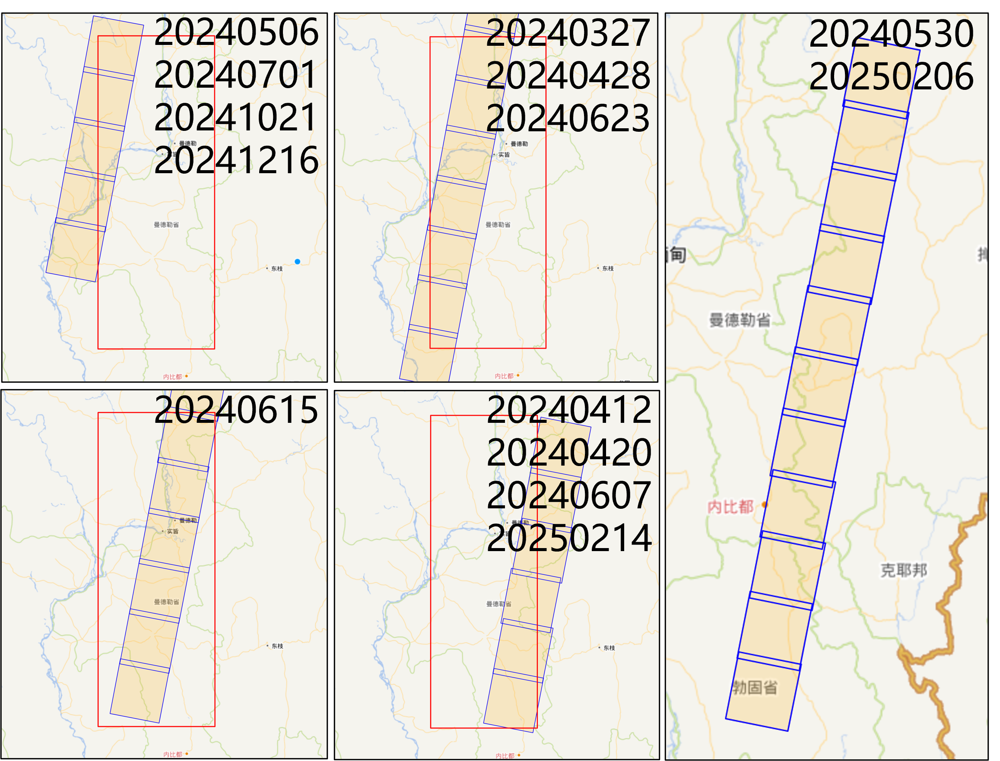

## SAR and GNSS data

### Basic info

+ USGS EQ event page: https://earthquake.usgs.gov/earthquakes/eventpage/us7000pn9s/executive
  - Mw 7.7
  - 2025-03-28 06:20:52 (UTC)
  - 21.996°N, 95.926°E
  - 10.0 km depth

+ Temblor insights: https://temblor.net/earthquake-insights/magnitude-7-7-earthquake-strikes-near-mandalay-myanmar-16724/

+ Bounding box in SNWE (6.5 x 3): 16.8, 23.3, 94.5, 97.5

### References:

+ USGS: https://experience.arcgis.com/experience/e40a6967c3ea42dd85bf44037e05482b
+ ARIA: https://aria-share.jpl.nasa.gov/20250328_Myanmar_EQ/
+ GSI: https://www.gsi.go.jp/cais/topic20250328-e_Myanmar.html

### 1. Co-seismic deformation [王祎笛，胡长洋]

Extract the co-seismic deformation via InSAR, MAI and speckle-tracking.

#### 1.1 Sentinel-1

+ S1_A143_20250315_20250327_20250408: /home/eedy/penguin/25EQ_myanmar/s1_a143
+ S1_A070_20250310_20250322_20250403: /home/eedy/penguin/25EQ_myanmar/s1_a070 √
+ S1_D106_20250228_20250324_20250405: /home/eedy/penguin/25EQ_myanmar/s1_d106 √
+ S1_D033_20250307_20250319_20250331: /home/eedy/penguin/25EQ_myanmar/s1_d033 √

| Sentinel-1 Asc orbits       | Sentinel-1 Desc orbits      |
| --------------------------- | --------------------------- |
|  |  |

#### 1.2 LuTan-1

+ LT1_A052_B8_20240806_20250330
+ LT1_A059_B3_20250205_XXXXXXXX
+ LT1_A060_B7_20240603_XXXXXXXX
+ LT1_A060_B9_20240705_XXXXXXXX

+ LT1_D116_B7_20241216_XXXXXXXX
+ LT1_D005_B6_20240623_XXXXXXXX
+ LT1_D005_B5_20240615_XXXXXXXX
+ LT1_D005_B4_20250214_XXXXXXXX
+ LT1_D005_B3_20240530_XXXXXXXX

| LuTan-1 Asc orbits       | LuTan-1 Desc orbits      |
| --------------------------- | --------------------------- |
|  |  |

#### 1.3 ALOS-2

#### 1.4 Sentinel-2

#### 1.5 Landsat

### 2. Damage proxy map [杨延晨]

Current existing products and reports：

Conperniscus EMS MAP: https://rapidmapping.emergency.copernicus.eu/EMSR798/reporting

DOWNLOAD:https://mapping.emergency.copernicus.eu/activations/EMSR798/

Microsoft’s philanthropic AI for Good Lab:https://satelliteimagerydemostg.z5.web.core.windows.net/damage-assessment/mandalay_earthquake_3_29_2025.html

NEWS FROM WECHAT:
https://mp.weixin.qq.com/s/JEBrEWKw4GEBSOgp2YPJVA

https://mp.weixin.qq.com/s/1vFoOZ3IppsrysVS3LoHEA

#### Damage proxy map result
+ 3 SLCs: 2 before EQ, 1 after EQ
+ 100km buffer distance from the earthquake center and affected fault. bbox in SNWE: 18.55, 22.95, 94.85, 97.05
+ Result(
+ s1_d033 multilook:9*3 √
+ s1_a070 multilook:9*3 √
+ ): with geo_phsig coherence.

combined s1_d033 with s1_d106, the DPM of the whole area is generated:

/penguin/yangyanchen/25EQ_myanmar/s1_d106/co/merged/d106_phsig.cor_score_norm_mask.tif

/penguin/yangyanchen/25EQ_myanmar/s1_d106/co/merged/d033_phsig.cor_score_norm_mask.tif

with a mask map: Combined statistics - Mean: -0.0206, Std: 0.1509, Threshold: μ + 2σ  0.2812 

MAP LOADING:/penguin/yangyanchen/25EQ_myanmar/DPM0408small.jpg AND /penguin/yangyanchen/25EQ_myanmar/DPM0408BIG.jpg

s1_d033 multilook:9*3 √

/penguin/yangyanchen/25EQ_myanmar/s1_d033/co/merged/geo_phsig.cor_score.tif
/penguin/yangyanchen/25EQ_myanmar/s1_d033/co/merged/geo_phsig.cor_score_norm_mask.tif

 s1_d106 multilook:9*3 √

/penguin/yangyanchen/25EQ_myanmar/s1_d106/co/merged/geo_phsig.cor_score.tif
/penguin/yangyanchen/25EQ_myanmar/s1_d106/co/merged/geo_phsig.cor_score_norm_mask.tif

 s1_a070 multilook:9*3 √
 
/penguin/yangyanchen/25EQ_myanmar/s1_a070/co/merged/geo_phsig.cor_score.tif
/penguin/yangyanchen/25EQ_myanmar/s1_a070/co/merged/geo_phsig.cor_score_norm_mask.tif

**Details:/penguin/yangyanchen/25EQ_myanmarDPM.ipynb**

### 3. Interseismic deformation via MAI time series [梁存任; old priority]

+ Sentinel-1 asc track 143, 2014-10-27 to 2025-03-27 (280 acquisitions), post-eq acquisition: 2025-04-08 (11:48)
+ Sentinel-1 asc track 070, 2014-10-10 to 2025-03-22 (273 acquisitions), post-eq acquisition: 2024-04-03 (11:39)
+ Sentinel-1 dsc track 106, 2014-10-12 to 2025-03-24 (349 acquisitions), post-eq acquisition: 2025-04-05 (23:33)
+ Sentinel-1 dsc track 033, 2014-10-07 to 2025-03-19 (284 acquisitions), post-eq acquisition: 2025-03-31 (23:25) √
