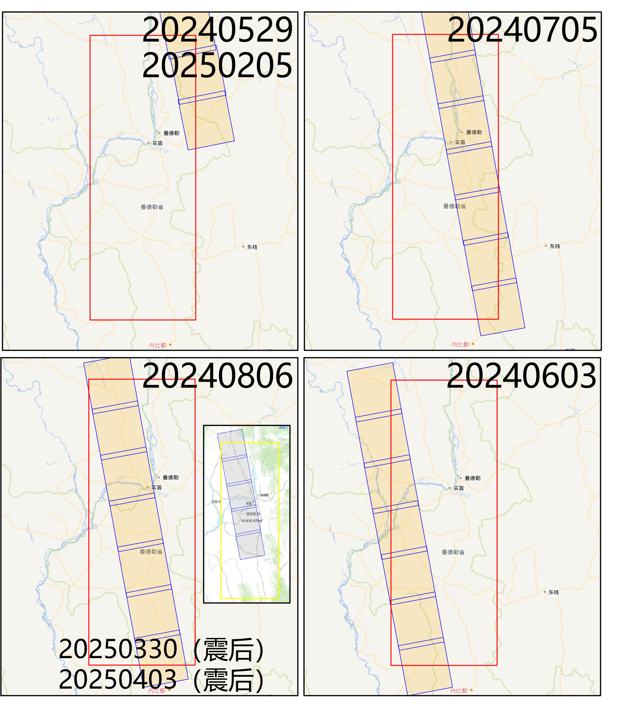

## SAR and GNSS data

### Basic info

+ USGS EQ event page: https://earthquake.usgs.gov/earthquakes/eventpage/us7000pn9s/executive
  - Mw 7.7
  - 2025-03-28 06:20:52 (UTC)
  - 21.996°N, 95.926°E
  - 10.0 km depth

+ Temblor insights: https://temblor.net/earthquake-insights/magnitude-7-7-earthquake-strikes-near-mandalay-myanmar-16724/

+ Bounding box in SNWE: 18, 23, 95, 97

### SAR

+ Sentinel-1 asc track 143, 2014-10-27 to 2025-03-27 (280 acquisitions), post-eq acquisition: 2025-04-08 (11:48)
+ Sentinel-1 asc track 070, 2014-10-10 to 2025-03-22 (273 acquisitions), post-eq acquisition: 2024-04-03 (11:39)
+ Sentinel-1 dsc track 106, 2014-10-12 to 2025-03-24 (349 acquisitions), post-eq acquisition: 2025-04-05 (23:33)
+ Sentinel-1 dsc track 033, 2014-10-07 to 2025-03-19 (284 acquisitions), post-eq acquisition: 2025-03-31 (23:25) √
+ bbox:18,24,94,98

| Sentinel-1 Asc orbits       | Sentinel-1 Desc orbits      |
| --------------------------- | --------------------------- |
|  |  |

+ LuTan-1
+ bbox:20,23,95.3,96.5

| LuTan-1 Asc orbits       | LuTan-1 Desc orbits      |
| --------------------------- | --------------------------- |
|  |  |

+ ALOS-2
+ ALOS-4

### Products

#### 3D Co-seismic deformation via InSAR, MAI, speckle-tracking [王祎笛，胡长洋]

+ S1_A143_20250315(5frame)_20250327(5frame)_20250408 : /home/eedy/penguin/25EQ_myanmar/s1_a143
+ S1_A070_20250310(6frame)_20250322(6frame)_20250403 : /home/eedy/penguin/25EQ_myanmar/s1_a070
+ S1_D106_20250228(5frame)_20250324(5frame)_20250405 : /home/eedy/penguin/25EQ_myanmar/s1_d106
+ S1_D033_20250307(5frame)_20250319(5frame)_20250331(5frame) : /home/eedy/penguin/25EQ_myanmar/s1_d033

#### Damage proxy map [杨延晨]

+ 3 SLCs: 2 before EQ, 1 after EQ

#### Interseismic deformation via MAI time series [梁存任]
